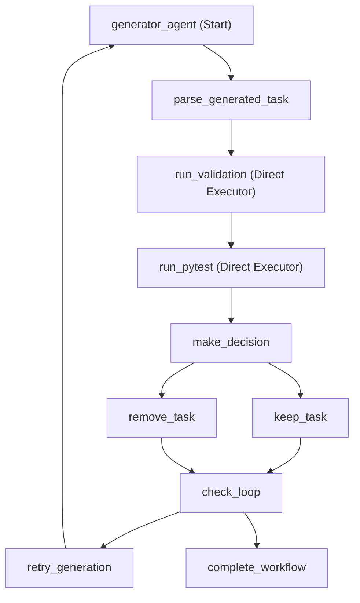

# K8s Task Generation Workflow

## Overview

`workflow.py` implements a retry-based conditional workflow using Microsoft Agent Framework's `WorkflowBuilder` pattern. It generates a single Kubernetes learning task with automatic retry on failure. The workflow validates the task, runs tests, and automatically removes tasks that fail validation or tests, then retries until success or max retries reached.

## Quick Start

```bash
# Run the workflow (generates 1 task with retry on failure)
source .venv/bin/activate
python workflow.py

# Generate visualization only
python visualize_workflow.py

# Launch DevUI with full workflow
./launch_devui.sh
```

## DevUI

Launch DevUI with the full workflow and all agents:

```bash
./launch_devui.sh
# or
python launch_devui_full.py
```

**Registered Entities:**
- ✅ K8s Task Workflow (with retry loop)
- ✅ Generator Agent (with MCP filesystem)
- ✅ Validator Agent
- ✅ Pytest Agent

**Features:**
- Retry loop (up to 3 attempts)
- Topic-focused generation
- Two decision points (keep/remove, retry/complete)
- Shared state management
- Same as workflow.py

## Workflow Architecture



## Workflow Components

### Agents (1 + 2 Direct Executors)

1. **generator_agent** - Creates complete K8s task with all required files (uses LLM)
2. **run_validation** - Direct executor: validates task structure (NO LLM, pure Python)
3. **run_pytest** - Direct executor: runs pytest tests (NO LLM, subprocess execution)

### Executors (8)

1. **parse_generated_task** - Parses generator response and extracts task ID
2. **run_validation** - Direct validation executor (NO LLM - pure Python file checks)
3. **run_pytest** - Direct pytest executor (NO LLM - subprocess execution)
4. **make_decision** - Combines validation + test results, makes keep/remove decision
5. **keep_task** - Success path (validation + tests passed)
6. **remove_task** - Failure path (deletes task directory, increments retry_count)
7. **check_loop** - Checks if should retry or complete
8. **retry_generation** - Creates request for retry generation (loops back)
9. **complete_workflow** - Terminates workflow on success or max retries

### Conditional Logic

#### Decision Point 1: Keep vs Remove
- **Executor**: `parse_tests_and_decide`
- **Selection Function**: `select_action()`
- **Logic**: `validation.is_valid AND test.is_valid`
- **Routes to**:
  - `keep_task` if BOTH validation and tests pass ✅
  - `remove_task` if EITHER validation or tests fail ❌

#### Decision Point 2: Retry vs Complete
- **Executor**: `check_loop`
- **Selection Function**: `select_loop_action()`
- **Logic**: `NOT should_keep AND retry_count < max_retries`
- **Routes to**:
  - `retry_generation` if task failed and retries available 🔄
  - `complete_workflow` if task succeeded OR max retries reached 🏁

## Execution Flow

```
1. Generate Task
   ↓
2. Parse Generated Task (extract task ID)
   ↓
3. Run Validation (direct executor - NO LLM)
   ↓
4. Run Tests (direct executor - NO LLM)
   ↓
5. Make Decision (combine validation + test results)
   ↓
6. Decision Point 1 🔀
   ├─→ ✅ Keep Task (if validation=true AND tests=true)
   └─→ ❌ Remove Task (if validation=false OR tests=false)
   ↓
7. Check Loop Condition
   ↓
8. Decision Point 2 🔀
   ├─→ 🔄 Retry Generation (if NOT success AND retry_count < max_retries) → back to step 1
   └─→ 🏁 Complete Workflow (if success OR retry_count >= max_retries) → END
```

## Structured Output Models

### ValidationResult
```python
class ValidationResult(BaseModel):
    is_valid: bool          # Whether validation passed
    reason: str             # Reason for result
    task_id: str           # Task ID being validated
    task_directory: str    # Task directory path
```

### TestResult
```python
class TestResult(BaseModel):
    is_valid: bool          # Whether tests passed
    reason: str             # Test execution summary
    task_id: str           # Task ID being tested
    task_directory: str    # Task directory path
```

### CombinedValidationResult
```python
@dataclass
class CombinedValidationResult:
    validation: ValidationResult
    test: TestResult
    retry_count: int = 0    # Current retry attempt
    max_retries: int = 3    # Maximum retry attempts
    
    @property
    def should_keep(self) -> bool:
        return self.validation.is_valid and self.test.is_valid
    
    @property
    def should_retry(self) -> bool:
        return not self.should_keep and self.retry_count < self.max_retries
```

## Loop Implementation

The workflow implements a retry loop using edges (not external Python loops):

### Loop Structure
```
keep_task → check_loop → complete_workflow (SUCCESS)
remove_task → check_loop → [retry_generation OR complete_workflow]
retry_generation → generator_agent (loop back to start)
```

### Shared State Management
- **retry_count**: Tracks number of retry attempts (incremented in `remove_task`)
- **max_retries**: Maximum retry attempts (default: 3)
- **target_topic**: The Kubernetes concept to generate (e.g., "ConfigMaps and environment variables")
- **validation_{task_id}**: Stores validation results for retrieval during testing phase

### Loop Termination
The workflow terminates when:
1. Task succeeds (validation AND tests pass) → `complete_workflow`
2. `retry_count >= max_retries` → `complete_workflow`
3. `complete_workflow` yields output without sending messages
4. Workflow becomes idle and ends naturally

## Example Output

```
🚀 Starting workflow for topic: ConfigMaps and environment variables
   Existing tasks: 15
[EXECUTOR] parse_generated_task: Extracting task ID...
✅ Extracted task ID: 082_configmap_env
[EXECUTOR] parse_validation_result: Parsing validation response...
❌ FAILED Validation: Missing file: test_05_check.py
🔀 DECISION: REMOVE task 082_configmap_env
❌ REMOVING TASK: 082_configmap_env
   Retry attempts: 1/3
🔄 CHECK_LOOP: Retry count 1/3
   → Will retry generation
🔄 RETRY: Attempt 2/3
[EXECUTOR] parse_generated_task: Extracting task ID...
✅ Extracted task ID: 083_configmap_basics
✅ PASSED Validation: All required files present
✅ PASSED Tests: All tests passed
✅ KEEPING TASK: 083_configmap_basics
   Retry attempts: 1
🏁 COMPLETE: Task 083_configmap_basics successfully generated after 1 retries
WORKFLOW COMPLETE
```

## Workflow Visualization

The workflow can be visualized in multiple formats:

### Generate Visualizations

```bash
source .venv/bin/activate
python visualize_workflow.py
```

This generates:
- `workflow_graph.svg` - Scalable Vector Graphics (best for web/docs)
- `workflow_graph.png` - Raster image (329x829 pixels)
- `workflow_graph.pdf` - Print-ready format

### View Visualizations

```bash
# SVG (recommended for web)
xdg-open workflow_graph.svg

# PNG (quick view)
xdg-open workflow_graph.png

# PDF (printing)
xdg-open workflow_graph.pdf
```

## Comparison with main.py

| Feature | main.py | workflow.py |
|---------|---------|-------------|
| Pattern | Sequential async functions | Agent Framework Workflow |
| Validation | Manual | Automated with structured output |
| Test Failures | Logged only | Automatically removes failed tasks |
| Conditional Logic | None | Routes based on validation + tests |
| Loop Implementation | External Python loop | Workflow edges with conditional routing |
| Task Generation | Single task | Single task with retry |
| State Management | Variables | Shared state + message passing |
| Extensibility | Limited | Easy to add more agents/steps |
| Visualization | No | Yes (Mermaid, SVG, PNG, PDF) |
| Termination | After 1 task | After success OR max retries |

## Key Features

### 1. Structured Output
- Validation and test results use Pydantic models
- Type-safe data passing between executors
- Clear success/failure indicators

### 2. Conditional Routing
- Uses `add_multi_selection_edge_group()` for branching
- Two decision points: keep/remove and continue/complete
- Automatic cleanup of failed tasks

### 3. Loop Implementation
- Workflow loops using edges (not external Python loops)
- Shared state tracks retry count and target topic
- Terminates on success or max retries
- No infinite loops - guaranteed termination

### 4. State Management
- **Shared State**: Stores retry_count, max_retries, target_topic, and validation results
- **Message Passing**: Data flows through typed workflow messages
- **Hybrid Approach**: Uses both patterns appropriately

### 5. Automatic Cleanup
- Failed tasks are automatically deleted from filesystem
- Uses absolute paths from `PATHS.tests_root`
- Logs deletion for audit trail

## Executor Naming Convention

### Parse Executors
- **Pattern**: `parse_<what>_<optional_context>`
- **Purpose**: Parse responses from agents or previous executors
- **Examples**: `parse_generated_task`, `parse_validation_result`

### Request Creation Executors
- **Pattern**: `create_<agent>_request`
- **Purpose**: Create requests for agent executors
- **Examples**: `create_validation_request`, `create_pytest_request`

### Action Executors
- **Pattern**: `<verb>_<noun>`
- **Purpose**: Perform final actions
- **Examples**: `keep_task`, `remove_task`

### Decision Executors
- **Pattern**: `<action>_and_decide`
- **Purpose**: Make routing decisions
- **Examples**: `parse_tests_and_decide`

## Requirements

- Python 3.12+
- `agent-framework` package
- `graphviz` Python package (>=0.20.0) for visualization
- Graphviz system package (`sudo apt-get install graphviz`)
- Azure OpenAI credentials configured

## Workflow Characteristics

- **Type**: Sequential with conditional branching and retry loop
- **Agents**: 1 (Generator only - validator and pytest are direct executors)
- **Direct Executors**: 2 (run_validation, run_pytest - NO LLM)
- **Other Executors**: 6 (parsing, decision, retry control)
- **Decision Points**: 2 (keep vs remove, retry vs complete)
- **Branches**: 4 (keep, remove, retry_generation, complete)
- **Loop**: Edge-based retry with shared state tracking
- **Max Retries**: Configurable (default: 3)
- **Goal**: Generate 1 successful task
- **State Management**: Hybrid (shared state + message passing)
- **Error Handling**: Automatic task removal on failure with retry
- **Termination**: Natural (success or max retries)
- **LLM Usage**: Only for generation (validation/testing use pure Python)

## Future Enhancements

1. ~~Add retry logic for failed tasks~~ ✅ Implemented
2. Store validation/test results in database
3. Generate reports of passed/failed tasks
4. Add more validation rules
5. Implement task difficulty levels
6. Add parallel task generation
7. Email notifications for failures
8. Integration with CI/CD pipelines
9. Topic suggestion based on existing tasks
10. Adaptive retry limits based on failure patterns

## References

- [Microsoft Agent Framework Workflows](https://learn.microsoft.com/en-us/agent-framework/user-guide/workflows/)
- [Workflow Visualization](https://learn.microsoft.com/en-us/agent-framework/user-guide/workflows/visualization)
- [Conditional Workflows Sample](https://github.com/microsoft/Agent-Framework-Samples/tree/main/07.Workflow)
