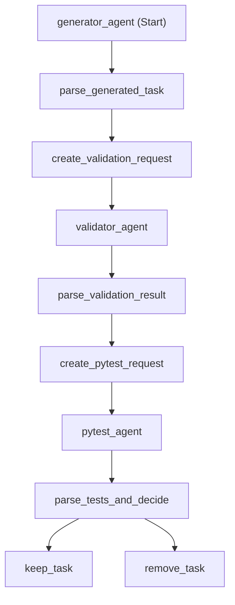

# K8s Task Generation Workflow

## Overview

`workflow.py` implements a conditional workflow using Microsoft Agent Framework's `WorkflowBuilder` pattern. It generates Kubernetes learning tasks, validates them, runs tests, and automatically removes tasks that fail validation or tests.

## Quick Start

```bash
# Run the workflow
source .venv/bin/activate
python workflow.py

# Generate visualization only
python visualize_workflow.py
```

## Workflow Architecture



## Workflow Components

### Agents (3)

1. **generator_agent** - Creates complete K8s task with all required files
2. **validator_agent** - Validates task structure, YAML syntax, Python syntax, Jinja templates
3. **pytest_agent** - Runs all tests in the task directory

### Executors (7)

1. **parse_generated_task** - Parses generator response and extracts task ID
2. **create_validation_request** - Creates validation request for validator agent
3. **parse_validation_result** - Parses validation response into structured `ValidationResult`
4. **create_pytest_request** - Creates pytest request for pytest agent
5. **parse_tests_and_decide** - Parses test results, combines with validation, makes decision
6. **keep_task** - Success path (validation + tests passed)
7. **remove_task** - Failure path (deletes task directory)

### Conditional Logic

- **Decision Point**: `parse_tests_and_decide`
- **Selection Function**: `select_action()`
- **Logic**: `validation.is_valid AND test.is_valid`
- **Routes to**:
  - `keep_task` if BOTH validation and tests pass ✅
  - `remove_task` if EITHER validation or tests fail ❌

## Execution Flow

```
1. Generate Task
   ↓
2. Parse Generated Task (extract task ID)
   ↓
3. Create Validation Request
   ↓
4. Validate Task
   ↓
5. Parse Validation Result
   ↓
6. Create Pytest Request
   ↓
7. Run Tests
   ↓
8. Parse Tests & Make Decision
   ↓
9. Decision Point 🔀
   ├─→ ✅ Keep Task (if validation=true AND tests=true)
   └─→ ❌ Remove Task (if validation=false OR tests=false)
```

## Structured Output Models

### ValidationResult
```python
class ValidationResult(BaseModel):
    is_valid: bool          # Whether validation passed
    reason: str             # Reason for result
    task_id: str           # Task ID being validated
    task_directory: str    # Task directory path
```

### TestResult
```python
class TestResult(BaseModel):
    is_valid: bool          # Whether tests passed
    reason: str             # Test execution summary
    task_id: str           # Task ID being tested
    task_directory: str    # Task directory path
```

### CombinedValidationResult
```python
@dataclass
class CombinedValidationResult:
    validation: ValidationResult
    test: TestResult
    
    @property
    def should_keep(self) -> bool:
        return self.validation.is_valid and self.test.is_valid
```

## Example Output

```
🚀 Starting workflow...
[EXECUTOR] parse_generated_task: Extracting task ID...
✅ Extracted task ID: 001_configmap_env
[EXECUTOR] create_validation_request: Creating validation request...
[EXECUTOR] parse_validation_result: Parsing validation response...
✅ PASSED Validation: All required files present
[EXECUTOR] create_pytest_request: Creating pytest request...
[EXECUTOR] parse_tests_and_decide: Parsing test results...
❌ FAILED Tests: Tests failed
🔀 DECISION: REMOVE task 001_configmap_env
❌ REMOVING TASK: 001_configmap_env
🗑️ Deleted directory: /path/to/task
WORKFLOW COMPLETE
```

## Workflow Visualization

The workflow can be visualized in multiple formats:

### Generate Visualizations

```bash
source .venv/bin/activate
python visualize_workflow.py
```

This generates:
- `workflow_graph.svg` - Scalable Vector Graphics (best for web/docs)
- `workflow_graph.png` - Raster image (329x829 pixels)
- `workflow_graph.pdf` - Print-ready format

### View Visualizations

```bash
# SVG (recommended for web)
xdg-open workflow_graph.svg

# PNG (quick view)
xdg-open workflow_graph.png

# PDF (printing)
xdg-open workflow_graph.pdf
```

## Comparison with main.py

| Feature | main.py | workflow.py |
|---------|---------|-------------|
| Pattern | Sequential async functions | Agent Framework Workflow |
| Validation | Manual | Automated with structured output |
| Test Failures | Logged only | Automatically removes failed tasks |
| Conditional Logic | None | Routes based on validation + tests |
| State Management | Variables | Workflow messages |
| Extensibility | Limited | Easy to add more agents/steps |
| Visualization | No | Yes (Mermaid, SVG, PNG, PDF) |

## Key Features

### 1. Structured Output
- Validation and test results use Pydantic models
- Type-safe data passing between executors
- Clear success/failure indicators

### 2. Conditional Routing
- Uses `add_multi_selection_edge_group()` for branching
- Decision based on combined validation + test results
- Automatic cleanup of failed tasks

### 3. Message Passing
- Data flows through workflow messages (not shared state)
- Each executor receives typed input and produces typed output
- Follows Microsoft Agent Framework patterns

### 4. Automatic Cleanup
- Failed tasks are automatically deleted from filesystem
- Uses absolute paths from `PATHS.tests_root`
- Logs deletion for audit trail

## Executor Naming Convention

### Parse Executors
- **Pattern**: `parse_<what>_<optional_context>`
- **Purpose**: Parse responses from agents or previous executors
- **Examples**: `parse_generated_task`, `parse_validation_result`

### Request Creation Executors
- **Pattern**: `create_<agent>_request`
- **Purpose**: Create requests for agent executors
- **Examples**: `create_validation_request`, `create_pytest_request`

### Action Executors
- **Pattern**: `<verb>_<noun>`
- **Purpose**: Perform final actions
- **Examples**: `keep_task`, `remove_task`

### Decision Executors
- **Pattern**: `<action>_and_decide`
- **Purpose**: Make routing decisions
- **Examples**: `parse_tests_and_decide`

## Requirements

- Python 3.12+
- `agent-framework` package
- `graphviz` Python package (>=0.20.0) for visualization
- Graphviz system package (`sudo apt-get install graphviz`)
- Azure OpenAI credentials configured

## Workflow Characteristics

- **Type**: Sequential with conditional branching
- **Agents**: 3 (Generator, Validator, Pytest)
- **Executors**: 7 (parsing, request creation, decision)
- **Decision Points**: 1 (keep vs remove)
- **Branches**: 2 (success path, failure path)
- **State Management**: Message passing (no shared state)
- **Error Handling**: Automatic task removal on failure

## Future Enhancements

1. Add retry logic for failed tasks
2. Store validation/test results in database
3. Generate reports of passed/failed tasks
4. Add more validation rules
5. Implement task difficulty levels
6. Add parallel task generation
7. Email notifications for failures
8. Integration with CI/CD pipelines

## References

- [Microsoft Agent Framework Workflows](https://learn.microsoft.com/en-us/agent-framework/user-guide/workflows/)
- [Workflow Visualization](https://learn.microsoft.com/en-us/agent-framework/user-guide/workflows/visualization)
- [Conditional Workflows Sample](https://github.com/microsoft/Agent-Framework-Samples/tree/main/07.Workflow)
