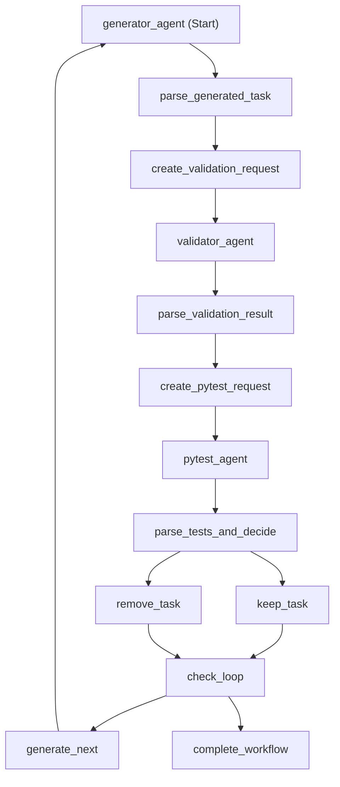

# K8s Task Generation Workflow

## Overview

`workflow.py` implements a looping conditional workflow using Microsoft Agent Framework's `WorkflowBuilder` pattern. It generates multiple Kubernetes learning tasks, validates them, runs tests, and automatically removes tasks that fail validation or tests. The workflow loops until it reaches the configured maximum number of tasks.

## Quick Start

```bash
# Run the workflow (generates 3 tasks by default)
source .venv/bin/activate
python workflow.py

# Generate visualization only
python visualize_workflow.py

# Launch DevUI with full workflow
./launch_devui.sh
```

## DevUI

Launch DevUI with the full workflow and all agents:

```bash
./launch_devui.sh
# or
python launch_devui_full.py
```

**Registered Entities:**
- ✅ K8s Task Workflow (with loop)
- ✅ Generator Agent (with MCP filesystem)
- ✅ Validator Agent
- ✅ Pytest Agent

**Features:**
- Loop functionality (generates 3 tasks)
- Two decision points (keep/remove, continue/complete)
- Shared state management
- Same as workflow.py

## Workflow Architecture



## Workflow Components

### Agents (3)

1. **generator_agent** - Creates complete K8s task with all required files
2. **validator_agent** - Validates task structure, YAML syntax, Python syntax, Jinja templates
3. **pytest_agent** - Runs all tests in the task directory

### Executors (10)

1. **parse_generated_task** - Parses generator response and extracts task ID
2. **create_validation_request** - Creates validation request for validator agent
3. **parse_validation_result** - Parses validation response into structured `ValidationResult`, stores in shared state
4. **create_pytest_request** - Creates pytest request for pytest agent
5. **parse_tests_and_decide** - Parses test results, retrieves validation from shared state, makes decision
6. **keep_task** - Success path (validation + tests passed)
7. **remove_task** - Failure path (deletes task directory)
8. **check_loop** - Checks if should continue generating more tasks
9. **generate_next** - Creates request for next task generation (loops back)
10. **complete_workflow** - Terminates workflow when max tasks reached

### Conditional Logic

#### Decision Point 1: Keep vs Remove
- **Executor**: `parse_tests_and_decide`
- **Selection Function**: `select_action()`
- **Logic**: `validation.is_valid AND test.is_valid`
- **Routes to**:
  - `keep_task` if BOTH validation and tests pass ✅
  - `remove_task` if EITHER validation or tests fail ❌

#### Decision Point 2: Continue vs Complete
- **Executor**: `check_loop`
- **Selection Function**: `select_loop_action()`
- **Logic**: `task_count < max_tasks`
- **Routes to**:
  - `generate_next` if more tasks needed 🔄
  - `complete_workflow` if max tasks reached 🏁

## Execution Flow

```
1. Generate Task
   ↓
2. Parse Generated Task (extract task ID)
   ↓
3. Create Validation Request
   ↓
4. Validate Task
   ↓
5. Parse Validation Result (store in shared state)
   ↓
6. Create Pytest Request
   ↓
7. Run Tests
   ↓
8. Parse Tests & Make Decision (retrieve validation from shared state)
   ↓
9. Decision Point 1 🔀
   ├─→ ✅ Keep Task (if validation=true AND tests=true)
   └─→ ❌ Remove Task (if validation=false OR tests=false)
   ↓
10. Check Loop Condition
   ↓
11. Decision Point 2 🔀
   ├─→ 🔄 Generate Next (if task_count < max_tasks) → back to step 1
   └─→ 🏁 Complete Workflow (if task_count >= max_tasks) → END
```

## Structured Output Models

### ValidationResult
```python
class ValidationResult(BaseModel):
    is_valid: bool          # Whether validation passed
    reason: str             # Reason for result
    task_id: str           # Task ID being validated
    task_directory: str    # Task directory path
```

### TestResult
```python
class TestResult(BaseModel):
    is_valid: bool          # Whether tests passed
    reason: str             # Test execution summary
    task_id: str           # Task ID being tested
    task_directory: str    # Task directory path
```

### CombinedValidationResult
```python
@dataclass
class CombinedValidationResult:
    validation: ValidationResult
    test: TestResult
    task_count: int = 0     # Current task count
    max_tasks: int = 3      # Maximum tasks to generate
    
    @property
    def should_keep(self) -> bool:
        return self.validation.is_valid and self.test.is_valid
    
    @property
    def should_continue(self) -> bool:
        return self.task_count < self.max_tasks
```

## Loop Implementation

The workflow implements a loop using edges (not external Python loops):

### Loop Structure
```
keep_task → check_loop → [generate_next OR complete_workflow]
remove_task → check_loop → [generate_next OR complete_workflow]
generate_next → generator_agent (loop back to start)
```

### Shared State Management
- **task_count**: Tracks number of tasks processed (incremented in `parse_tests_and_decide`)
- **max_tasks**: Maximum tasks to generate (default: 3)
- **validation_{task_id}**: Stores validation results for retrieval during testing phase

### Loop Termination
The workflow terminates when:
1. `task_count >= max_tasks`
2. `check_loop` routes to `complete_workflow`
3. `complete_workflow` yields output without sending messages
4. Workflow becomes idle and ends naturally

## Example Output

```
🚀 Starting workflow...
[EXECUTOR] parse_generated_task: Extracting task ID...
✅ Extracted task ID: 001_configmap_env
[EXECUTOR] parse_validation_result: Parsing validation response...
✅ PASSED Validation: All required files present
[EXECUTOR] parse_tests_and_decide: Parsing test results...
❌ FAILED Tests: Tests failed
🔀 DECISION: REMOVE task 001_configmap_env
❌ REMOVING TASK: 001_configmap_env
   Tasks completed: 1/3
🔄 CHECK_LOOP: Task count 1/3
   → Will generate task 2
🔄 LOOP: Generating task 2/3
... (repeats for tasks 2 and 3)
🏁 COMPLETE: Generated 3/3 tasks
WORKFLOW COMPLETE
```

## Workflow Visualization

The workflow can be visualized in multiple formats:

### Generate Visualizations

```bash
source .venv/bin/activate
python visualize_workflow.py
```

This generates:
- `workflow_graph.svg` - Scalable Vector Graphics (best for web/docs)
- `workflow_graph.png` - Raster image (329x829 pixels)
- `workflow_graph.pdf` - Print-ready format

### View Visualizations

```bash
# SVG (recommended for web)
xdg-open workflow_graph.svg

# PNG (quick view)
xdg-open workflow_graph.png

# PDF (printing)
xdg-open workflow_graph.pdf
```

## Comparison with main.py

| Feature | main.py | workflow.py |
|---------|---------|-------------|
| Pattern | Sequential async functions | Agent Framework Workflow |
| Validation | Manual | Automated with structured output |
| Test Failures | Logged only | Automatically removes failed tasks |
| Conditional Logic | None | Routes based on validation + tests |
| Loop Implementation | External Python loop | Workflow edges with conditional routing |
| Task Generation | Single task | Multiple tasks (configurable max) |
| State Management | Variables | Shared state + message passing |
| Extensibility | Limited | Easy to add more agents/steps |
| Visualization | No | Yes (Mermaid, SVG, PNG, PDF) |
| Termination | After 1 task | After max_tasks reached |

## Key Features

### 1. Structured Output
- Validation and test results use Pydantic models
- Type-safe data passing between executors
- Clear success/failure indicators

### 2. Conditional Routing
- Uses `add_multi_selection_edge_group()` for branching
- Two decision points: keep/remove and continue/complete
- Automatic cleanup of failed tasks

### 3. Loop Implementation
- Workflow loops using edges (not external Python loops)
- Shared state tracks task count
- Terminates naturally when max tasks reached
- No infinite loops - guaranteed termination

### 4. State Management
- **Shared State**: Stores task_count, max_tasks, and validation results
- **Message Passing**: Data flows through typed workflow messages
- **Hybrid Approach**: Uses both patterns appropriately

### 5. Automatic Cleanup
- Failed tasks are automatically deleted from filesystem
- Uses absolute paths from `PATHS.tests_root`
- Logs deletion for audit trail

## Executor Naming Convention

### Parse Executors
- **Pattern**: `parse_<what>_<optional_context>`
- **Purpose**: Parse responses from agents or previous executors
- **Examples**: `parse_generated_task`, `parse_validation_result`

### Request Creation Executors
- **Pattern**: `create_<agent>_request`
- **Purpose**: Create requests for agent executors
- **Examples**: `create_validation_request`, `create_pytest_request`

### Action Executors
- **Pattern**: `<verb>_<noun>`
- **Purpose**: Perform final actions
- **Examples**: `keep_task`, `remove_task`

### Decision Executors
- **Pattern**: `<action>_and_decide`
- **Purpose**: Make routing decisions
- **Examples**: `parse_tests_and_decide`

## Requirements

- Python 3.12+
- `agent-framework` package
- `graphviz` Python package (>=0.20.0) for visualization
- Graphviz system package (`sudo apt-get install graphviz`)
- Azure OpenAI credentials configured

## Workflow Characteristics

- **Type**: Sequential with conditional branching and looping
- **Agents**: 3 (Generator, Validator, Pytest)
- **Executors**: 10 (parsing, request creation, decision, loop control)
- **Decision Points**: 2 (keep vs remove, continue vs complete)
- **Branches**: 4 (keep, remove, generate_next, complete)
- **Loop**: Edge-based with shared state tracking
- **Max Tasks**: Configurable (default: 3)
- **State Management**: Hybrid (shared state + message passing)
- **Error Handling**: Automatic task removal on failure
- **Termination**: Natural (workflow becomes idle)

## Future Enhancements

1. Add retry logic for failed tasks
2. Store validation/test results in database
3. Generate reports of passed/failed tasks
4. Add more validation rules
5. Implement task difficulty levels
6. Add parallel task generation
7. Email notifications for failures
8. Integration with CI/CD pipelines

## References

- [Microsoft Agent Framework Workflows](https://learn.microsoft.com/en-us/agent-framework/user-guide/workflows/)
- [Workflow Visualization](https://learn.microsoft.com/en-us/agent-framework/user-guide/workflows/visualization)
- [Conditional Workflows Sample](https://github.com/microsoft/Agent-Framework-Samples/tree/main/07.Workflow)
