# Deep Dive: Multi-Agent Workflow Architecture for Automated Kubernetes Assessments

Traditional Kubernetes education pipelines are manual and brittle: instructors design tasks, build fixtures, write validators, and debug grading edge cases by hand. The `k8s-game-rule-builder` architecture replaces that process with a **multi-agent + deterministic-validation** system where LLMs draft and repair task assets, while non-LLM execution gates decide what is allowed to ship.

The workflow is implemented with the Microsoft Agent Framework and uses strongly defined execution boundaries: **agents author**, **executors validate**, and **workflow routing controls retries**.

## Why this system generates tests (design rationale)

This project does not generate tests just to "check code." It generates tests because, in a Kubernetes learning game, the test suite *is the grading contract*.

The design goals are:

1. **Scale content creation**: instructors should not hand-author every task and checker.
2. **Keep grading objective**: student success is measured against Kubernetes API state, not subjective review.
3. **Avoid fragile tasks**: generated tasks must survive empty/wrong cluster states without crashing.
4. **Make failures repairable**: when checks break, the system should patch and re-validate automatically.

So the pipeline generates a full task package (`setup`, `answer`, `check`, `cleanup`) where tests define exactly what "correct" means.

## Lifecycle: from concept to production-ready grader

Reader mental model: this is a **content compiler** with validation stages, not a single chat completion.

### Phase 1: Pedagogical intent -> structured concept

The Idea Agent converts a topic into a constrained concept object (objective, progression, task IDs, difficulty variants). Memory rules block duplicates and previously failed concepts.

### Phase 2: Concept -> executable grading package

The Generator Agent turns that concept into files:

- student instructions (`instruction.md`)
- learning material (`concept.md`)
- parameter source (`session.json`)
- setup and answer manifests (`setup.template.yaml`, `answer.template.yaml`)
- deterministic pytest flow (`test_01` ... `test_06`)

At this point, output is still untrusted draft content.

### Phase 3: Structural correctness gate

Deterministic validation checks file presence, syntax, JSON/YAML shape, and template correctness. This catches basic integrity issues before cluster execution.

### Phase 4: Behavioral correctness gate (real cluster)

Pytest executes against Kubernetes and verifies runtime behavior using real `kubectl`-derived state. This proves that generated checks actually evaluate cluster resources as intended.

### Phase 5: Anti-false-positive gate (skip-answer mode)

The same suite runs with `SKIP_ANSWER_TESTS=True` to verify grader integrity:

- answer deployment is skipped
- `test_05_check.py` must fail

If it still passes, the grader is invalid (it would accept wrong student submissions).

### Phase 6: Self-healing repair loop

On any failure, deterministic error logs are fed into the Fixer Agent, which patches only broken files. The workflow then re-enters validation + test gates.

### Phase 7: Finalization

- If all gates pass -> task is kept as production-ready content.
- If retries are exhausted -> task is moved to `unsuccessful/` with `FAILURE_REPORT.txt` for human triage.

This lifecycle explains the core architecture decision: **LLMs generate candidate graders, deterministic execution certifies them.**

## Concrete generated sample (what the pipeline actually produces)

Below is a representative generated task for topic: **ConfigMap Environment Variable Injection**.

### Generated directory layout

```text
tests/game01/050_configmap_env_injection/
├── __init__.py
├── instruction.md
├── concept.md
├── session.json
├── setup.template.yaml
├── answer.template.yaml
├── test_01_setup.py
├── test_02_ready.py
├── test_03_answer.py
├── test_05_check.py
└── test_06_cleanup.py
```

### `session.json` (runtime variables)

```json
{
  "namespace": "{{random_name()}}{{random_number(100,999)}}{{student_id()}}",
  "configmap_name": "{{random_name()}}",
  "deployment_name": "{{random_name()}}",
  "container_name": "app",
  "env_key": "APP_MODE",
  "env_value": "production"
}
```

Why this exists: task values are randomized per student/session, so tests verify behavior by variable contract instead of hardcoded names.

### `setup.template.yaml` (baseline state only)

```yaml
apiVersion: v1
kind: Namespace
metadata:
  name: {{ namespace }}
```

Why this exists: setup should create prerequisites only. It must not accidentally include the final answer.

### `answer.template.yaml` (expected correct solution)

```yaml
apiVersion: v1
kind: ConfigMap
metadata:
  name: {{ configmap_name }}
  namespace: {{ namespace }}
data:
  {{ env_key }}: "{{ env_value }}"
---
apiVersion: apps/v1
kind: Deployment
metadata:
  name: {{ deployment_name }}
  namespace: {{ namespace }}
spec:
  replicas: 1
  selector:
    matchLabels:
      app: env-demo
  template:
    metadata:
      labels:
        app: env-demo
    spec:
      containers:
        - name: {{ container_name }}
          image: nginx:latest
          env:
            - name: {{ env_key }}
              valueFrom:
                configMapKeyRef:
                  name: {{ configmap_name }}
                  key: {{ env_key }}
```

Why this exists: defines canonical "correct cluster state" that graders must detect.

### `test_02_ready.py` (wait for setup resources)

```python
import json
import time
from tests.helper.kubectrl_helper import build_kube_config, run_kubectl_command


class TestReady:
    def test_001_namespace_active(self, json_input):
        kube_config = build_kube_config(
            json_input["cert_file"], json_input["key_file"], json_input["host"]
        )
        time.sleep(2)
        result = run_kubectl_command(
            kube_config,
            f"kubectl get namespace {json_input['namespace']} -o json",
        )
        data = json.loads(result)
        assert data.get("status", {}).get("phase") == "Active"
```

Why this matters: validates setup-stage readiness only. It should not check answer resources yet.

### `test_05_check.py` (student grading contract)

```python
import json
from tests.helper.kubectrl_helper import build_kube_config, run_kubectl_command


class TestCheck:
    def test_001_configmap_key_exists(self, json_input):
        kube_config = build_kube_config(
            json_input["cert_file"], json_input["key_file"], json_input["host"]
        )
        result = run_kubectl_command(
            kube_config,
            f"kubectl get configmap {json_input['configmap_name']} -n {json_input['namespace']} -o json",
        )
        data = json.loads(result)
        assert data["data"][json_input["env_key"]] == json_input["env_value"]

    def test_002_deployment_uses_configmap_env(self, json_input):
        kube_config = build_kube_config(
            json_input["cert_file"], json_input["key_file"], json_input["host"]
        )
        result = run_kubectl_command(
            kube_config,
            f"kubectl get deployment {json_input['deployment_name']} -n {json_input['namespace']} -o json",
        )
        data = json.loads(result)
        env = data["spec"]["template"]["spec"]["containers"][0].get("env", [])
        matched = [
            e for e in env
            if e.get("name") == json_input["env_key"]
            and e.get("valueFrom", {}).get("configMapKeyRef", {}).get("name") == json_input["configmap_name"]
            and e.get("valueFrom", {}).get("configMapKeyRef", {}).get("key") == json_input["env_key"]
        ]
        assert matched, "Deployment container must consume env var from ConfigMap key"
```

Why this matters: this is the real grading logic. If a student deploys wrong resource wiring, this test fails with explicit reason.

### Why skip-answer validation is essential for this sample

When `SKIP_ANSWER_TESTS=True`, answer deployment is skipped. In this mode:

- `test_03_answer.py` should be skipped
- `test_05_check.py` must fail (ConfigMap/Deployment wiring is absent)

If `test_05_check.py` still passes, the grader is broken (false positive), and the workflow routes to Fixer.

## Rule Builder Workflow Flowchart

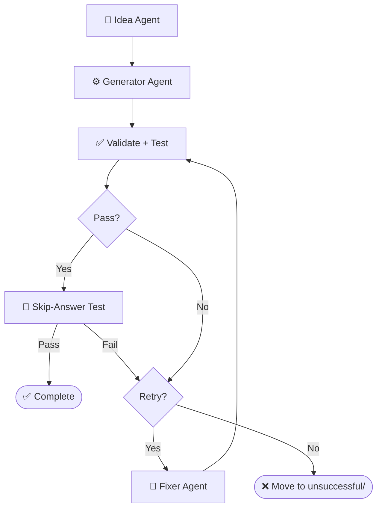

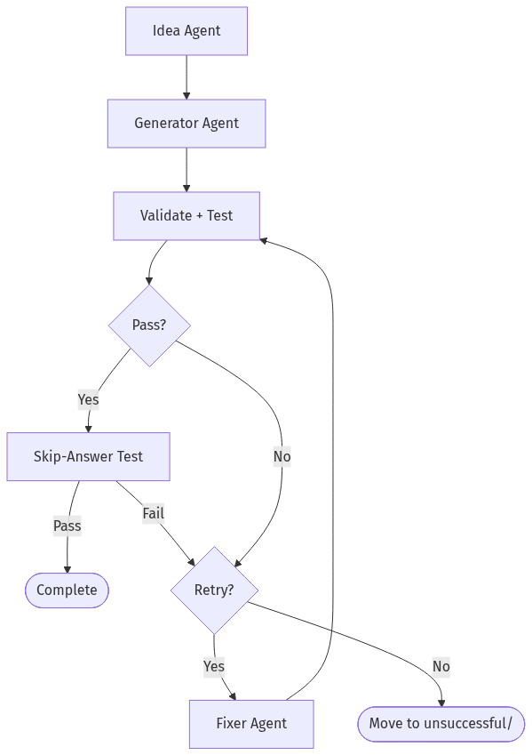

## Multi-graph architecture views

### 1) Control-plane graph (orchestration DAG)

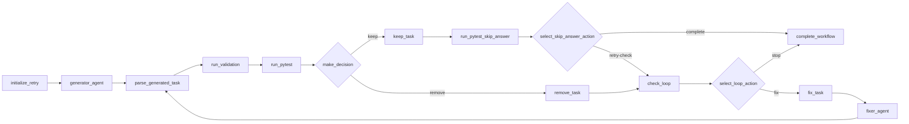

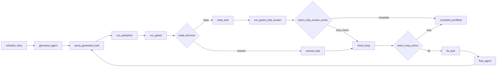

### 2) Runtime sequence (who calls what)

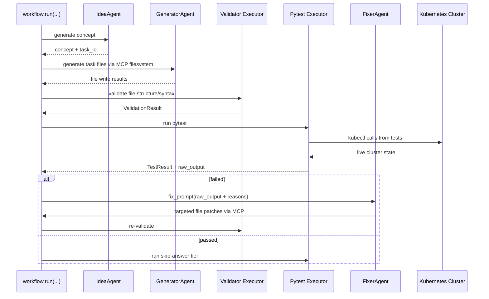

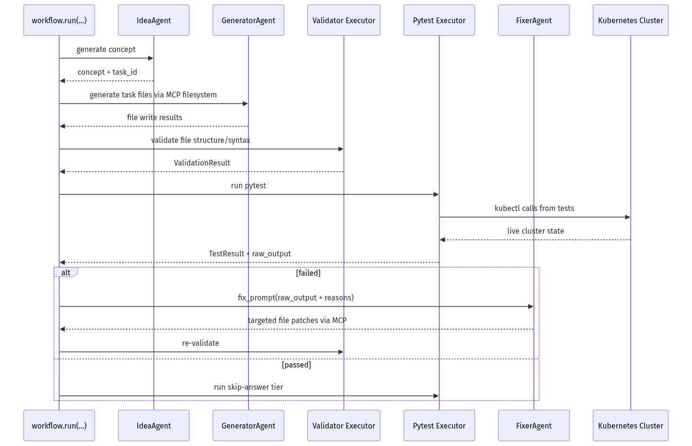

### 3) State machine (task lifecycle)

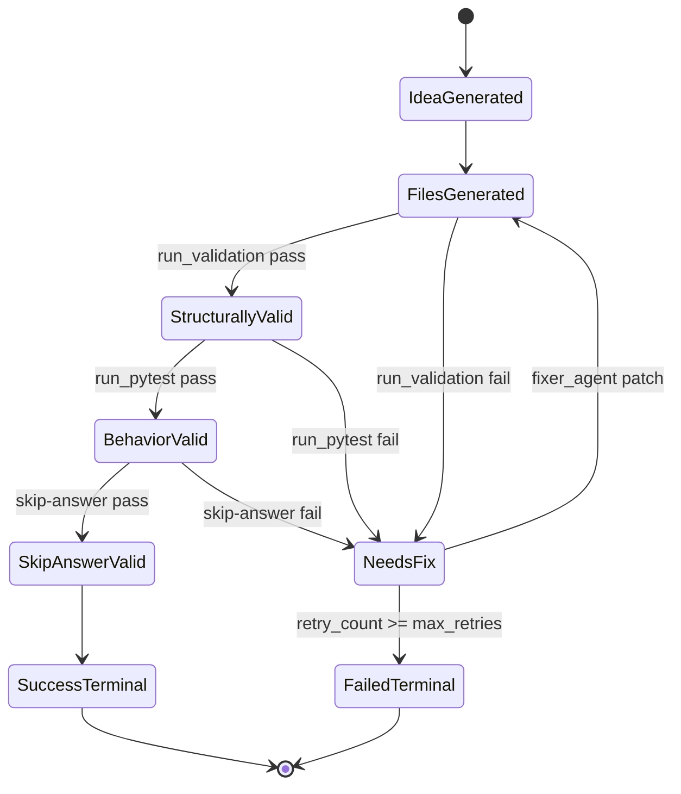

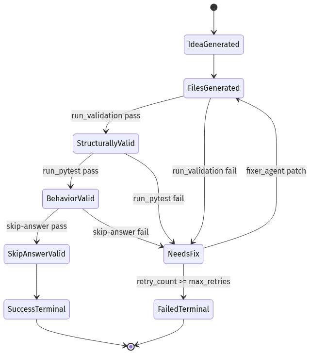

### 4) Prompt lifecycle graph (how prompts evolve)

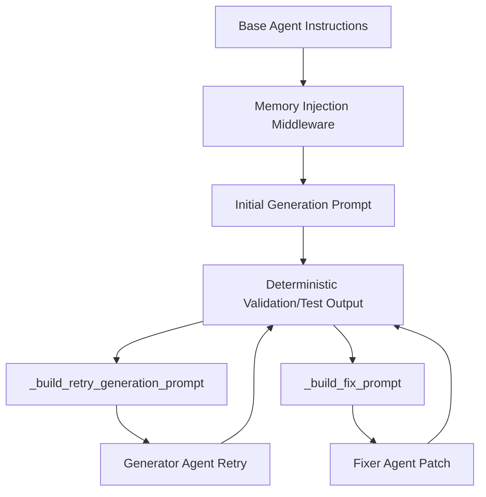

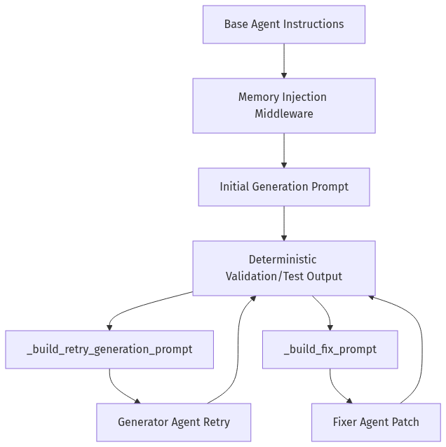

### 5) MCP + Kubernetes execution boundary graph

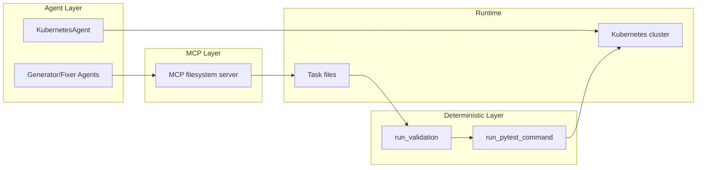

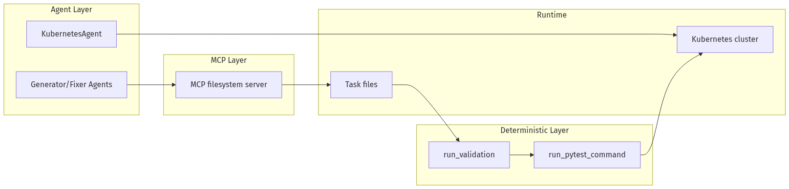

## Core Agent Framework Primitives Used

This repository is a practical example of Agent Framework as a graph orchestrator, not just an agent wrapper.

1. **`WorkflowBuilder`** builds a typed DAG with explicit edges.
2. **`@executor` functions** implement deterministic nodes (validation, pytest, decisions, routing prep).
3. **`AgentExecutor`** wraps LLM agents so they behave as graph nodes.
4. **`WorkflowContext` shared state** carries typed data and retry metadata between nodes.
5. **`add_multi_selection_edge_group(...)` + selector functions** enforce conditional routing.
6. **`MCPStdioTool`** connects filesystem MCP tools into agents for controlled file I/O.

Production graph construction (from `workflow/builder.py`) looks like this:

```python
workflow = (
    WorkflowBuilder(start_executor=initialize_retry)
    .add_edge(initialize_retry, generator_executor)
    .add_edge(generator_executor, parse_generated_task)
    .add_edge(parse_generated_task, run_validation)
    .add_edge(run_validation, run_pytest)
    .add_edge(run_pytest, make_decision)
    .add_multi_selection_edge_group(
        make_decision,
        [keep_task, remove_task],
        selection_func=select_action,
    )
    .add_edge(keep_task, run_pytest_skip_answer)
    .add_multi_selection_edge_group(
        run_pytest_skip_answer,
        [check_loop, complete_workflow],
        selection_func=select_skip_answer_action,
    )
    .add_multi_selection_edge_group(
        check_loop,
        [fix_task, complete_workflow],
        selection_func=select_loop_action,
    )
    .add_edge(fix_task, fixer_executor)
    .add_edge(fixer_executor, parse_generated_task)
    .build()
)
```

This is the architectural heart of the system: agents and deterministic executors are first-class nodes in the same graph.

## Detailed Node-by-Node Mechanics

### 1. Idea Agent (🧠): Concept Synthesis with Memory Constraints

The Idea Agent (`agents/k8s_task_idea_agent.py`) generates a structured concept with three difficulty variations (BEGINNER/INTERMEDIATE/ADVANCED). It is memory-aware:

- `task_ideas_memory.json` tracks successful concepts.
- `task_ideas_failure_memory.json` tracks concepts that failed downstream.
- Memory constraints are injected using `AgentMiddleware` (system-level prompt injection) to avoid duplicate or previously failed concepts.

For Responses-only models, the agent switches to a tool-call contract (`save_k8s_task_concept`) instead of structured response formatting.

### 2. Generator Agent (⚙️): MCP-Backed File Authoring

The Generator Agent receives a strict prompt and writes task files through MCP filesystem tools. Key framework details:

- Built through `chat_client.as_agent(...)`.
- MCP tool attached via `tools=mcp_tool`.
- Function-call execution observability added with `LoggingFunctionMiddleware`.
- Uses absolute-path-only policy in instructions to prevent path drift.

### 3. Deterministic Validation + Test (✅): Non-LLM Gates

After generation, the graph moves through deterministic executors:

- `run_validation` calls pure Python checks (`k8s_task_validator`).
- `run_pytest` executes `pytest --import-mode=importlib --rootdir=. ...`.
- Raw pytest output is persisted in workflow state for later fixing.

This is critical: no LLM is asked whether code is correct.

### 4. Skip-Answer Test (🧪): Grader Correctness Gate

Even if standard tests pass, the workflow enforces a second tier:

```bash
SKIP_ANSWER_TESTS=True pytest --import-mode=importlib --rootdir=.
```

Implementation detail: the executor writes JUnit XML, parses it, and asserts that:

- `test_03_answer.py` is skipped
- `test_05_check.py` fails as expected

If `test_05_check.py` does **not** fail, the task is treated as invalid and sent back to retry/fix.

### 5. Fixer Agent + Retry Loop (🔧): Bounded Self-Healing

On failure, `fix_task` builds a targeted prompt containing:

- failure reasons from deterministic nodes
- full captured pytest output
- explicit rule to patch only broken files in place

The Fixer Agent runs through `AgentExecutor`, writes patches via MCP, and the graph loops back to `parse_generated_task`.

Retries are stateful (`retry_count`, `max_retries`) and hard-bounded. On exhaustion, `complete_workflow` moves the task to `unsuccessful/<game>/` and writes `FAILURE_REPORT.txt`.

## Agent Prompt Design (The Part That Makes It Work)

If you want to understand *why* this pipeline works, you need to inspect prompts as **operational contracts**, not generic instructions.

### Real Idea Agent Prompt (from code)

```python
IDEA_AGENT_INSTRUCTIONS = (
    "You are a Kubernetes task idea generator that creates detailed task concepts with three difficulty variations. "
    "Read official K8s documentation and propose comprehensive learning concepts for a Kubernetes game. "
    "\n\nYour task:\n"
    "1. Choose ONE Kubernetes concept not yet covered (check context for existing concepts)\n"
    "2. Generate exactly 3 variations: BEGINNER, INTERMEDIATE, and ADVANCED\n"
    "3. Use 3-digit task IDs (001-999) in format: XXX_concept_name_level (e.g., 041_secrets_basic)\n"
    "4. Each variation should build on the previous one with increasing complexity\n"
    "5. Include practical, hands-on scenarios covering: Workloads, Services, Storage, Configuration, Security, Scheduling, Policies\n"
    "\nProvide the concept, tags, description, and 3 variations with task_id, difficulty, title, objective, key_skills, and estimated_time."
)
```

Responses-only models use a stricter tool-call version:

```python
IDEA_AGENT_INSTRUCTIONS_TOOL_CALL = (
    IDEA_AGENT_INSTRUCTIONS + "\n\n"
    "**CRITICAL**: You MUST call the save_k8s_task_concept tool to save your generated concept.\n"
    "...\n"
    "Always call save_k8s_task_concept with your generated concept."
)
```

### Idea Agent Prompt Contract

The Idea Agent prompt enforces:

- one concept per run
- exactly three difficulty variations
- strict task ID format (`XXX_concept_name_level`)
- practical skill progression

Core pattern:

```text
You are a Kubernetes task idea generator...
1. Choose ONE Kubernetes concept not yet covered
2. Generate exactly 3 variations: BEGINNER, INTERMEDIATE, ADVANCED
3. Use 3-digit task IDs in format XXX_concept_name_level
...
```

It is strengthened by runtime memory injection:

- previously generated concepts are blocked
- previously failed concepts are blocked

For Responses-only models, the contract becomes tool-driven:

```text
CRITICAL: You MUST call the save_k8s_task_concept tool...
```

This reduces ambiguity in output structure and makes downstream parsing deterministic.

### Real Generator Agent Prompt (from code)

```python
def _get_generator_instructions():
    return (
        "You are a Kubernetes task generator with filesystem tools.\n"
        f"The MCP filesystem is rooted at: {PATHS.tests_root.parent}\n"
        f"You MUST use ABSOLUTE paths for ALL file operations.\n"
        f"Task directory: {PATHS.game_root}/XXX_task_name/\n"
        "...\n"
        "CRITICAL: test_02_ready.py checks resources from setup.template.yaml, NOT answer.template.yaml.\n"
        "...\n"
        "MUST use polling loops (60s timeout, 15s interval)\n"
        "MUST use try/except and safe .get() JSON access\n"
    )
```

The generator prompt is long on purpose: it encodes path correctness, file schema, YAML/Jinja structure, and testing strategy in a single deterministic contract.

### Generator Agent Prompt Contract

The Generator prompt is intentionally long and prescriptive because it defines filesystem safety and grading correctness requirements.

Key constraints encoded in the prompt:

1. **Absolute path writes only** (prevents writing to wrong workspace paths)
2. **No directory creation** (directory is pre-created by executor)
3. **Required file set** (`instruction.md`, `concept.md`, `session.json`, templates, tests)
4. **test-flow invariants**:
   - `test_01_setup.py` deploys setup
   - `test_02_ready.py` checks setup resources only
   - `test_03_answer.py` deploys answer
   - `test_05_check.py` validates final solution
5. **robust test coding style**: polling loops, try/except, `.get()`-based JSON parsing, explicit debug output

Example contract fragment:

```text
CRITICAL PATH RULES:
✅ CORRECT: /abs/path/tests/gameXX/050_task/file.py
❌ WRONG: tests/gameXX/050_task/file.py (relative)

CRITICAL: test_02_ready.py checks resources from setup.template.yaml,
NOT answer.template.yaml.
```

This is why generation quality is high before the Fixer loop even starts.

### Real Runtime Retry Prompt Builder (from code)

```python
def _build_retry_generation_prompt(combined: CombinedValidationResult) -> str:
    task_id = combined.test.task_id
    failure_reasons = _build_failure_reasons(combined)
    return (
        f"Generate a complete Kubernetes learning task with ID '{task_id}' about '{combined.target_topic}'. "
        f"This is retry attempt {combined.retry_count + 1} of {combined.max_retries}. "
        f"\n\n⚠️  PREVIOUS ATTEMPT FAILED:"
        f"\n{chr(10).join([f'  - {reason}' for reason in failure_reasons])}"
        f"\n\nIMPORTANT: You MUST use the exact task ID '{task_id}' - do not generate a new ID."
        f"\n\n✅ Directory already exists: {PATHS.game_root}/{task_id}/"
        f"\nWrite all files directly into this directory. Do NOT call create_directory."
        "..."
    )
```

This means retries are not generic retries; they are failure-conditioned retries with precise constraints.

### Fixer Agent Prompt Contract

The Fixer prompt is a repair protocol, not a regeneration prompt. It includes:

- exact failure reasons from deterministic validators
- raw pytest output
- instruction to read current task files first
- strict directive to patch only broken files

Core behavior constraints:

```text
DO NOT rewrite all files.
Make TARGETED FIXES to ONLY the broken files.
Use ABSOLUTE paths for all file operations.
```

This keeps retries cheap, preserves working artifacts, and improves convergence speed.

### Real Runtime Fix Prompt Builder (from code)

```python
def _build_fix_prompt(combined: CombinedValidationResult, raw_test_output: str) -> str:
    task_id = combined.test.task_id
    failure_reasons = _build_failure_reasons(combined)
    prompt = (
        f"Fix the failed Kubernetes task '{task_id}' located in '{PATHS.game_root}/{task_id}/'."
        f"\n\nThis is fix attempt {combined.retry_count + 1} of {combined.max_retries}."
        f"\n\n⚠️  TASK FAILED WITH THESE ERRORS:"
        f"\n{chr(10).join([f'  - {reason}' for reason in failure_reasons])}"
    )
    if raw_test_output:
        prompt += f"\n\n📋 FULL TEST OUTPUT:\n```\n{raw_test_output}\n```"
    prompt += (
        f"\n\n🔍 YOUR TASK:"
        f"\n1. READ all files from '{PATHS.game_root}/{task_id}/'"
        f"\n6. Make TARGETED FIXES to ONLY the broken files"
        f"\n7. WRITE ONLY the fixed files back"
        f"\n\n⚠️  CRITICAL: DO NOT rewrite all files! Only fix the broken ones!"
    )
    return prompt
```

### How Prompt Output Enters the Agent Framework Graph

The prompt builders above are used by deterministic executors and sent to agent nodes through `AgentExecutorRequest`:

```python
await ctx.send_message(
    AgentExecutorRequest(
        messages=[Message(role="user", contents=[fix_prompt])],
        should_respond=True
    )
)
```

So prompt generation and graph routing are tightly coupled: each route transition emits a specific prompt payload into the next LLM node.

### Runtime-Constructed Prompts in Executors

The most important prompts are built dynamically in workflow executors:

- `_build_retry_generation_prompt(...)`
- `_build_fix_prompt(...)`

These functions inject live context:

- `retry_count` / `max_retries`
- concept + objective metadata
- validation/test failure reasons
- full captured test logs

So each retry is context-rich and specific, not another blind generation attempt.

### Prompt + Middleware + Deterministic Gates = Reliability

In this repository, reliability does **not** come from prompt text alone. It comes from three layers working together:

1. Prompt contracts constrain agent behavior.
2. Middleware injects memory and logs tool invocations.
3. Deterministic executors enforce objective pass/fail gates.

That combination is why the workflow remains auditable and predictable even when LLM outputs vary.

## Agent Framework Execution Model in This Repo

## Strongly-Typed Message Passing

`workflow/models.py` defines transport models used between nodes:

- `ValidationResult` and `TestResult` (Pydantic)
- `CombinedValidationResult` (dataclass with `should_keep` and `should_retry`)
- `InitialWorkflowState` (seed payload for each run)

This keeps node contracts explicit and simplifies selector logic.

## Fail-Fast Shared State Management

Executors use `ctx.get_state(...)` with a sentinel (`_MISSING`) and raise explicit exceptions if required state is absent. This prevents hidden fallback behavior and catches graph/data wiring errors early.

## Conditional Routing with Selectors

Selectors (`workflow/selectors.py`) encode graph decisions:

- `select_action` → keep vs remove
- `select_skip_answer_action` → complete vs loop
- `select_loop_action` → fix vs complete

This separates decision policy from executor implementation.

## Streaming Workflow Runtime

`workflow.run(initial_state, stream=True)` emits output events incrementally. The runner (`workflow/runner.py`) consumes these events to detect successful completions and update concept memory accordingly.

## Agent Construction and API Selection Strategy

The repository uses Azure CLI auth (`AzureCliCredential`) and dynamically selects API mode by deployment name (`agents/config.py`):

- **Chat Completions path**: `OpenAIChatCompletionClient`
- **Responses-only model path**: `OpenAIChatClient` or custom `ResponsesAgent`

Why this matters: some codex-class deployments are Responses-only, so the architecture supports both without changing workflow logic.

## How MCP Actually Controls Kubernetes (Important Distinction)

In this repo, MCP is used for **filesystem control**; Kubernetes control is done through **kubectl tools**.

## 1) MCP server role: controlled file I/O

The workflow starts MCP stdio servers (official filesystem server) and mounts them into agents:

```python
docs_mcp_tool = MCPStdioTool(
    name="filesystem_docs",
    command="npx",
    args=["-y", "@modelcontextprotocol/server-filesystem", str(PATHS.k8s_docs_root)],
    load_prompts=False,
)

tests_mcp_tool = MCPStdioTool(
    name="filesystem_tests",
    command="npx",
    args=["-y", "@modelcontextprotocol/server-filesystem", str(PATHS.tests_root.parent)],
    load_prompts=False,
)
```

Those MCP tools are passed into Generator/Fixer agents, which then call MCP file functions (read/write/list) inside allowed roots only.

## 2) Kubernetes cluster control role: kubectl execution tool

Cluster actions are not performed by MCP filesystem server; they are performed by a dedicated function tool:

```python
def run_kubectl_command(command: str) -> str:
    kubeconfig_path = os.environ.get("KUBECONFIG", "/home/developer/.kube/config")
    cmd_list = ["kubectl"] + command.split()
    result = subprocess.run(
        cmd_list,
        capture_output=True,
        text=True,
        check=True,
        env={**os.environ, "KUBECONFIG": kubeconfig_path},
    )
    return result.stdout
```

And the Kubernetes agent forces tool usage:

```python
agent = responses_client.as_agent(
    name="KubernetesAgent",
    instructions="...You MUST use the run_kubectl_command tool...",
    tools=[run_kubectl_command],
    default_options={"tool_choice": "required"},
)
```

So the control plane is:

1. **MCP filesystem** → manipulate generated task files.
2. **kubectl tool** → query/mutate real cluster state.
3. **deterministic pytest/validator executors** → accept or reject results.

## 3) End-to-end command flow in practice

When generated tests run, they execute real `kubectl get ... -o json` checks in test code, and the deterministic runner captures raw output:

```python
pytest_command = f"pytest --import-mode=importlib --rootdir=. {task_with_val.task_directory}/"
result = run_pytest_command(pytest_command)
ctx.set_state(f"raw_output_{task_with_val.task_id}", raw_output)
```

This means Kubernetes state verification is always grounded in live command output, not model speculation.

## Should MCP run Kubernetes tests?

Short answer: **not in this design**.

Current architecture keeps test execution deterministic and local:

- pytest is run by `run_pytest_command(...)` (pure Python subprocess runner)
- test results are parsed and stored in workflow state
- retry/fix routing uses those deterministic outputs

This is intentional. If test execution were delegated to an LLM-facing MCP command tool, you would lose strict control over execution semantics and error handling.

Recommended pattern:

1. Use MCP for file/document access and controlled editing.
2. Use deterministic executors for pytest and validation.
3. Use LLM agents only for generation and repair.

If you still want MCP-driven test execution, add a **separate locked-down command MCP server** (only whitelisted pytest/kubectl commands), but keep pass/fail decision logic in deterministic executors.

## How tests are run in this workflow (with code)

The workflow executes tests in deterministic executors, not inside LLM agents.

### 1) Workflow node calls pytest runner

`run_pytest` executor builds the command and calls the pure Python runner:

```python
@executor(id="run_pytest")
async def run_pytest(task_with_val: TaskWithValidation, ctx: WorkflowContext[TestResult]) -> None:
    from agents.pytest_runner import run_pytest_command

    pytest_command = f"pytest --import-mode=importlib --rootdir=. {task_with_val.task_directory}/"
    result = run_pytest_command(pytest_command)

    raw_output = result["details"][0] if result.get("details") else ""
    ctx.set_state(f"raw_output_{task_with_val.task_id}", raw_output)
    ...
```

### 2) Deterministic subprocess execution

The runner normalizes command flags and executes pytest via subprocess:

```python
def run_pytest_command(command: str) -> dict[str, Any]:
    normalized_command = _normalize_pytest_command(command)  # adds -s if needed
    cmd_list = shlex.split(normalized_command)
    result = subprocess.run(
        cmd_list,
        capture_output=True,
        text=True,
        check=False,
        cwd=str(PATHS.pytest_rootdir),
    )
    combined_output = result.stdout + "\n" + result.stderr
    _save_test_output(normalized_command, combined_output, skip_answer)
    ...
```

Exit codes are interpreted deterministically:

- `0` → pass
- `5` → no tests collected (fail)
- others → fail with exit code reason

### 3) Skip-answer validation tier

After normal pass, the workflow runs pytest again with `SKIP_ANSWER_TESTS=True` and parses JUnit XML:

```python
os.environ["SKIP_ANSWER_TESTS"] = "True"
pytest_command = f"pytest --import-mode=importlib --rootdir=. --junitxml={junit_path} {task_dir}/"
result = run_pytest_command(pytest_command)
test_05_failed, test_03_skipped = _parse_skip_answer_junit(junit_path)
```

The parser checks per-testcase outcomes:

```python
if "test_05_check.py" in context and has_failure_or_error:
    test_05_failed = True
if "test_03_answer.py" in context and has_skipped:
    test_03_skipped = True
```

### 4) How failures trigger fix loop

If pytest fails (or skip-answer logic fails), failure reasons and raw output are pushed into state, then the Fixer Agent receives a generated fix prompt containing that output:

```python
ctx.set_state(f"failure_reasons_{task_id}", reasons)
ctx.set_state(f"raw_output_{task_id}", raw_output)
fix_prompt = _build_fix_prompt(combined, raw_test_output)
await ctx.send_message(
    AgentExecutorRequest(
        messages=[Message(role="user", contents=[fix_prompt])],
        should_respond=True
    )
)
```

That is the key loop: **deterministic test output drives LLM repair**, then deterministic tests re-run.

## ResponsesAgent Internals (Advanced Agent Framework Pattern)

The custom `ResponsesAgent` (`agents/responses_agent.py`) demonstrates a lower-level integration pattern:

1. Connect MCP tool lazily.
2. Call Responses API.
3. Parse `ResponseFunctionToolCall` items.
4. Execute tools (MCP + custom callables).
5. Feed `function_call_output` back to model.
6. Repeat until final text response.

It also runs a middleware chain around tool invocations, preserving observability and consistency with standard agent paths.

## Why This Architecture Is Robust

This design works because Agent Framework is used as a **deterministic orchestration layer around probabilistic generation**:

- LLM creativity is constrained by typed state and strict prompts.
- deterministic executors act as objective quality gates.
- retries are targeted, bounded, and auditable.
- failures produce durable forensic artifacts (`FAILURE_REPORT.txt` + test logs).

For Kubernetes education pipelines, this yields high throughput without sacrificing grader reliability.
