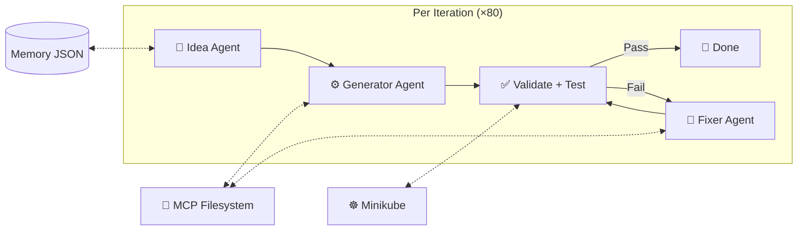
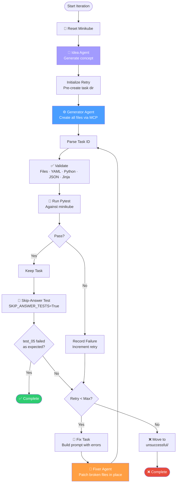
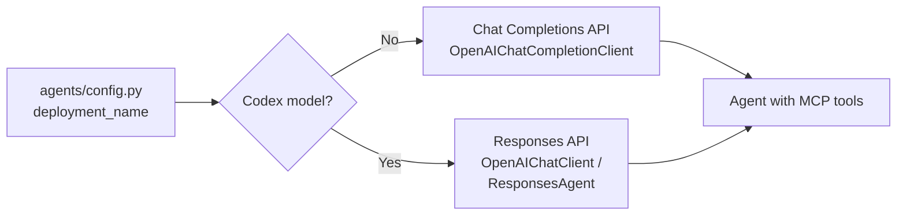

# K8s Game Rule Builder — Architecture

## System Overview

AI agents powered by Azure OpenAI generate Kubernetes learning game tasks. Each task is a self-contained directory with templates, tests, and documentation. The workflow generates tasks in a loop, validates them, runs tests against a minikube cluster, and uses a Fixer Agent to patch failures in place.

Authentication uses **Azure CLI credentials** (`AzureCliCredential`). The configured model determines which API is used — Chat Completions for standard models, Responses API for codex models. See `agents/config.py`.

### High-Level Overview



## Agents

| Agent | File | LLM | Purpose |
|-------|------|-----|---------|
| Task Idea | `k8s_task_idea_agent.py` | Yes | Generate unique K8s concepts with 3 difficulty variations |
| Task Generator | `k8s_task_generator_agent.py` | Yes | Create complete task scaffolding via MCP filesystem |
| Task Fixer | `k8s_task_fixer_agent.py` | Yes | Read errors, patch only broken files in place |
| Responses Agent | `responses_agent.py` | Yes | Custom agent for codex models (Responses API only) |
| Task Validator | `k8s_task_validator.py` | No | Check file structure, YAML/Python/JSON syntax, Jinja templates |
| PyTest Runner | `pytest_runner.py` | No | Run pytest via subprocess, parse exit codes |
| Filesystem | `filesystem_agent.py` | Yes | General-purpose MCP file operations |
| Kubernetes | `kubernetes_agent.py` | Yes | Execute kubectl commands |

## Workflow

The runner (`workflow/runner.py`) executes **80 iterations** by default. Each iteration generates one task:



Minikube is reset (delete + start) before each iteration.

### Key behaviors

- **Fix, not regenerate**: On failure the Fixer Agent reads existing files, analyzes errors, and writes only the broken files back. The task stays in the game folder throughout retries.
- **Skip-answer validation**: After tests pass, pytest runs again with `SKIP_ANSWER_TESTS=True` to confirm `test_05_check.py` fails when the answer isn't deployed.
- **Failure reporting**: After max retries, the task is moved to `unsuccessful/<game_name>/` with a `FAILURE_REPORT.txt` containing failure reasons, session.json content, and raw test output.

### Executors

All defined in `workflow/executors.py`:

| Executor | ID | What it does |
|----------|----|-------------|
| `initialize_retry` | `initialize_retry` | Set up shared state, pre-create task directory |
| Generator Agent | `generator_agent` | LLM creates all files (first attempt) |
| `parse_generated_task` | `parse_generated_task` | Extract task ID from response or state |
| `run_validation` | `run_validation` | Pure Python file/syntax checks |
| `run_pytest` | `run_pytest` | Subprocess pytest execution |
| `make_decision` | `make_decision` | Combine results, route keep/remove |
| `keep_task` | `keep_task` | Mark success, route to skip-answer test |
| `remove_task` | `remove_task` | Record failure, increment retry count |
| `run_pytest_skip_answer` | `run_pytest_skip_answer` | Validate test_05 fails without answer |
| `check_loop` | `check_loop` | Route to fix or complete |
| `fix_task` | `fix_task` | Build fix prompt with errors + test output |
| Fixer Agent | `fixer_agent` | LLM patches broken files (retries) |
| `complete_workflow` | `complete_workflow` | Success message or move to unsuccessful |

### Shared state

```python
{
    "task_id": str,
    "target_topic": str,
    "concept_description": str,
    "difficulty": str,
    "objective": str,
    "retry_count": int,           # 0-based
    "max_retries": int,           # default 3
    "validation_{task_id}": ValidationResult,
    "raw_output_{task_id}": str,  # full pytest output
    "failure_reasons_{task_id}": list[str],
}
```

### Selection functions

Defined in `workflow/selectors.py`:

- `select_action` — routes `make_decision` → `keep_task` or `remove_task`
- `select_skip_answer_action` — routes `run_pytest_skip_answer` → `check_loop` or `complete_workflow`
- `select_loop_action` — routes `check_loop` → `fix_task` or `complete_workflow`

## Dual API Support



| Model type | API | Client |
|-----------|-----|--------|
| Standard (gpt-4o, etc.) | Chat Completions | `OpenAIChatCompletionClient` |
| Codex (gpt-5.3-codex, etc.) | Responses API | `OpenAIChatClient` or custom `ResponsesAgent` |

Detection is automatic via `AzureOpenAI.use_responses_api` in `agents/config.py`.

For the Idea Agent:
- **Chat Completions** → structured outputs (`response_format=K8sTaskConcept`)
- **Responses API** → tool-call approach (`save_k8s_task_concept`)

## Memory

Two JSON files at the project root:

| File | Purpose |
|------|---------|
| `task_ideas_memory.json` | Successfully generated concepts — prevents re-generation |
| `task_ideas_failure_memory.json` | Concepts that failed validation/testing — prevents retrying |

Memory is injected via `TaskIdeasMemoryMiddleware` (Chat Completions) or prepended to instructions (Responses API).

## MCP Integration

File-writing agents use [@modelcontextprotocol/server-filesystem](https://github.com/modelcontextprotocol/servers/tree/main/src/filesystem) via `npx`. The runner creates two MCP tools:

- `filesystem_docs` — scoped to K8s documentation (for Idea Agent)
- `filesystem_tests` — scoped to tests root (for Generator and Fixer)

MCP tools connect lazily on first use.

## Generated Task Structure

Each task lives under `tests/<game_name>/<task_id>/`:

> Note: This `tests/...` location refers to the external K8s game repo path from `PATHS.tests_root`, not this builder repo.  
> This builder repo keeps its own unit tests under `unit_tests/`.

| File | Required | Description |
|------|----------|-------------|
| `__init__.py` | Yes | Empty package marker |
| `instruction.md` | Yes | Student-facing challenge |
| `concept.md` | Yes | Learning material (no solution code) |
| `session.json` | Yes | Template variables (plain JSON) |
| `setup.template.yaml` | Yes | Namespace + prerequisites (Jinja2) |
| `answer.template.yaml` | Yes | Complete solution (Jinja2) |
| `test_01_setup.py` | Yes | Deploy setup resources |
| `test_02_ready.py` | Yes | Wait for setup resources to be ready |
| `test_03_answer.py` | Yes | Deploy answer resources |
| `test_04_challenge.py` | No | Triggers/load generation |
| `test_05_check.py` | Yes | Validate the solution |
| `test_06_cleanup.py` | Yes | Delete namespace |

## Project Structure

```
k8s-game-rule-builder/
├── agents/
│   ├── config.py                   # Paths, Azure, validation config
│   ├── filesystem_agent.py         # MCP filesystem operations
│   ├── k8s_task_generator_agent.py # Task generation (LLM + MCP)
│   ├── k8s_task_fixer_agent.py     # Targeted task fixing (LLM + MCP)
│   ├── k8s_task_idea_agent.py      # Idea generation with memory
│   ├── k8s_task_validator.py       # Pure Python validator
│   ├── kubernetes_agent.py         # kubectl execution
│   ├── pytest_runner.py            # Pure Python test runner
│   ├── responses_agent.py          # Responses API agent for codex models
│   └── logging_middleware.py       # Function invocation logging
├── workflow/
│   ├── builder.py                  # Workflow graph construction
│   ├── executors.py                # 12 executor implementations
│   ├── models.py                   # Pydantic + dataclass models
│   ├── selectors.py                # Routing functions
│   ├── runner.py                   # Main runner (80-iteration loop)
│   └── idea_generator.py           # Idea generation logic
├── docs/
│   └── ARCHITECTURE.md             # This file
├── unit_tests/                     # Unit tests for this builder project
├── pytest.ini                      # Pytest config (collect from unit_tests/)
├── workflow.py                     # Entry point
├── launch_devui.sh                 # DevUI launcher
├── launch_devui_full.py            # DevUI setup with full workflow
├── setup.sh                        # Environment setup
├── requirements.txt                # Dependencies
├── task_ideas_memory.json          # Concept memory
├── task_ideas_failure_memory.json  # Failure memory
├── CHANGELOG.md                    # Version history
└── README.md                       # Quick start
```
