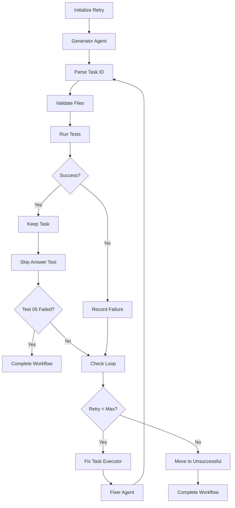

# Fix Workflow Architecture

## Overview

The fix workflow replaces the old "regenerate on failure" approach with a smarter "fix on failure" approach. This document explains the architecture and flow.

## Workflow Comparison

### Old Workflow (Regenerate)
```
Generate → Validate → Test → Fail → Delete → Generate Again (from scratch)
                                                    ↓
                                            Often repeats same mistakes
```

### New Workflow (Fix)
```
Generate → Validate → Test → Fail → Fix (in place) → Validate → Test
                        ↓                                          ↑
                       Pass → Skip Answer Test → Pass → Complete  │
                                      ↓                            │
                                     Fail → Retry Loop ────────────┘
                                              ↓
                                   Max retries → Move to Unsuccessful
```

## Detailed Flow



## Agent Responsibilities

### Generator Agent (First Attempt Only)

**File**: `agents/k8s_task_generator_agent.py`

**Responsibilities**:
- Create complete task from scratch
- Generate all 11 required files
- Follow established patterns
- Use proper Jinja2 templates

**When used**: Only on first attempt (retry_count = 0)

**Input**:
- Task concept and description
- Difficulty level
- Learning objectives
- Existing task IDs (to avoid duplicates)

**Output**:
- Complete task directory with all files

### Fixer Agent (Retry Attempts)

**File**: `agents/k8s_task_fixer_agent.py`

**Responsibilities**:
- Read failed task from game folder (task stays in place during retries)
- Analyze failure reasons from workflow context
- Parse test output for specific errors
- Make targeted fixes to broken files
- Write fixed files back to game folder (in place)

**When used**: On all retry attempts (retry_count > 0)

**Input**:
- Task ID and location in game folder
- Failure reasons (validation errors, test failures)
- Raw test output (full pytest output)
- Task metadata (concept, description, etc.)

**Output**:
- Fixed task files in game folder (same location)

## Executor Flow

### 1. initialize_retry
- Sets up shared state
- Prepares initial request
- Routes to generator on first attempt

### 2. generator_agent (AgentExecutor)
- Runs generator agent
- Creates complete task from scratch
- Only used on first attempt

### 3. parse_generated_task
- Extracts task ID from response
- Creates TaskInfo object
- Passes to validation

### 4. run_validation
- Validates file structure
- Checks YAML syntax
- Checks Python syntax
- Checks Jinja templates
- Creates ValidationResult

### 5. run_pytest
- Runs pytest tests
- Captures raw output
- Creates TestResult
- Stores raw output in shared state

### 6. make_decision
- Combines validation and test results
- Retrieves task metadata from shared state
- Creates CombinedValidationResult
- Routes to keep_task or remove_task

### 7a. keep_task
- Task passed all checks
- Keeps task in game folder
- Routes to run_pytest_skip_answer

### 7b. remove_task (renamed to record_failure)
- Task failed checks
- Records failure reasons in shared state
- Increments retry count
- Task stays in game folder for retry attempts
- Routes to check_loop

### 8. run_pytest_skip_answer
- Runs pytest with SKIP_ANSWER_TESTS=True environment variable
- Validates that test_03_answer.py is skipped
- Validates that test_05_check.py fails (expected behavior)
- If validation passes: routes to complete_workflow
- If validation fails: increments retry count and routes to check_loop

### 9. check_loop
- Checks if retry_count < max_retries
- Routes to fix_task or complete_workflow

### 10a. fix_task
- Constructs detailed fix prompt
- Includes failure reasons
- Includes raw test output
- Routes to fixer_agent

### 10b. complete_workflow
- Max retries reached: moves task to unsuccessful folder with FAILURE_REPORT.txt
- Task succeeded: keeps task in game folder
- Ends workflow

### 11. fixer_agent (AgentExecutor)
- Runs fixer agent
- Reads failed task files
- Makes targeted fixes
- Moves fixed files back
- Routes back to parse_generated_task

## Shared State Management

The workflow maintains these shared state variables:

```python
{
    "task_id": str,                    # Task identifier
    "target_topic": str,               # Kubernetes concept
    "concept_description": str,        # Detailed description
    "difficulty": str,                 # Beginner/Intermediate/Advanced
    "objective": str,                  # Learning objective
    "retry_count": int,                # Current retry attempt
    "max_retries": int,                # Maximum allowed retries
    "validation_{task_id}": ValidationResult,  # Validation results
    "raw_output_{task_id}": str,       # Full pytest output
}
```

## Error Information Flow

### Validation Errors
```
Validator → ValidationResult → CombinedValidationResult → fix_task → Fixer Agent
                                                                          ↓
                                                                    Sees specific
                                                                    validation errors
```

### Test Errors
```
PyTest → TestResult (with raw_output) → Shared State → fix_task → Fixer Agent
                                                                        ↓
                                                                  Sees full test
                                                                  output with errors
```

## File Movement

### During Retry Attempts
```
game02/
  └── 082_task_name/          ← Task stays here during retries
          ├── instruction.md
          ├── session.json
          └── ...

                ↓ Fixer reads and writes in place

game02/
  └── 082_task_name/          ← Fixed files written back here
          ├── instruction.md  ← Fixed version
          ├── session.json    ← Unchanged
          └── ...
```

### After Max Retries Exhausted
```
game02/
  └── 082_task_name/          ← Failed task after all retries
          ├── instruction.md
          ├── session.json
          └── ...

                ↓ Move to unsuccessful only after max retries

unsuccessful/
  └── game02/
      └── 082_task_name/      ← Final failed task with report
          ├── instruction.md
          ├── session.json
          ├── FAILURE_REPORT.txt  ← Added
          └── ...
```

## Success Criteria

A task is considered successful when:
1. ✅ All required files exist
2. ✅ YAML files have valid syntax
3. ✅ Python files have valid syntax
4. ✅ Jinja templates are valid
5. ✅ All pytest tests pass
6. ✅ Skip answer test passes (test_05_check.py fails when SKIP_ANSWER_TESTS=True)

## Failure Handling

### Common Failures and Fixes

| Failure Type | Fixer Action |
|-------------|--------------|
| Missing file | Create the missing file with correct content |
| YAML syntax error | Fix indentation, quotes, or structure |
| Python syntax error | Fix indentation, imports, or function signatures |
| Template variable error | Fix Jinja2 syntax ({{var}} not {var}) |
| Test assertion error | Fix test logic or expected values |
| Test timeout error | Add proper polling or increase timeout |
| Missing test_02_ready.py | Analyze setup.template.yaml and create appropriate readiness checks |
| Skip answer test failure | Fix test_05_check.py to properly validate answer resources (should fail when answer not deployed) |

## Benefits of Fix Approach

1. **Sees the problem**: Fixer gets full error context
2. **Preserves work**: Only fixes broken parts
3. **Learns from errors**: Uses specific error messages
4. **Higher success rate**: More likely to succeed than regenerating
5. **Faster**: Only changes what's needed
6. **Better debugging**: Clear separation of concerns
7. **No unnecessary moves**: Task stays in place during retries, only moved after all attempts fail

## Configuration

### Retry Limits

```python
# In workflow runner
initial_state = InitialWorkflowState(
    # ...
    retry_count=0,
    max_retries=3  # Adjust based on task complexity
)
```

### Recommended Settings

| Task Complexity | max_retries |
|----------------|-------------|
| Simple (basic resources) | 2 |
| Medium (multiple resources) | 3 (default) |
| Complex (advanced patterns) | 5 |

## Monitoring

### Log Messages

```
🔧 FIXING TASK: {task_id} (attempt {retry_count + 1}/{max_retries})
✅ Retrieved raw test output: {len} chars
⚠️  No raw test output found for {task_id}
❌ Task failed: {task_id}
```

### Success Indicators

```
✅ KEEPING TASK: {task_id}
🏁 COMPLETE: Task {task_id} successfully generated
```

### Failure Indicators

```
❌ Task failed: {task_id} (attempt X/Y)
❌ Moving task to unsuccessful folder after {retry_count} failed attempts
🏁 COMPLETE: Failed to generate valid task after {max_retries} retries. Task moved to unsuccessful folder.
```

## Future Enhancements

Potential improvements to the fix workflow:

1. **Incremental fixes**: Track which files were fixed to avoid re-fixing
2. **Fix history**: Store fix attempts in FAILURE_REPORT.txt
3. **Success metrics**: Track fix success rate per error type
4. **Smart routing**: Route to generator or fixer based on error type
5. **Parallel fixes**: Try multiple fix strategies simultaneously
6. **Learning**: Use successful fixes to improve fixer instructions

## Related Documentation

- [RETRY_LOGIC.md](RETRY_LOGIC.md) - Retry implementation details
- [ARCHITECTURE.md](ARCHITECTURE.md) - Overall system architecture
- [WORKFLOW.md](../WORKFLOW.md) - Workflow patterns and conventions
